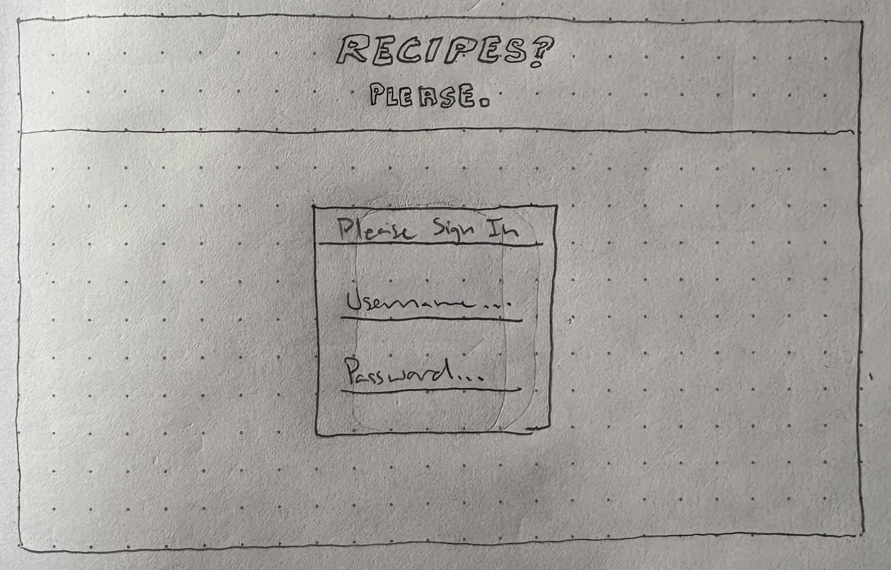
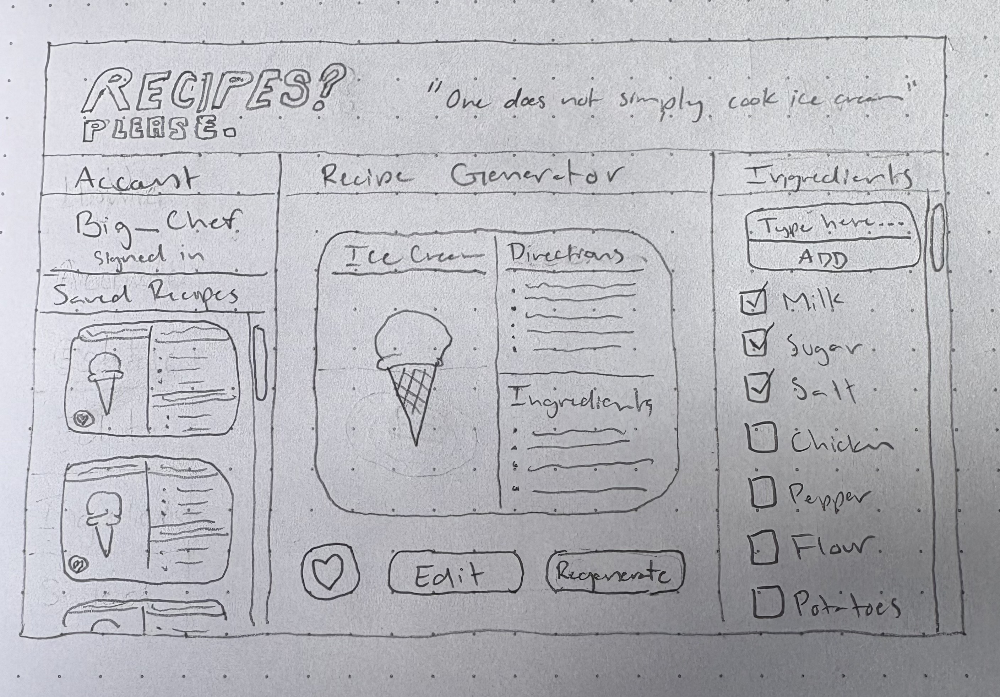

# Recipes Please

[My Notes](notes.md)

<!--
> [!NOTE]
>  This is a template for your startup application. You must modify this `README.md` file for each phase of your development. You only need to fill in the section for each deliverable when that deliverable is submitted in Canvas. Without completing the section for a deliverable, the TA will not know what to look for when grading your submission. Feel free to add additional information to each deliverable description, but make sure you at least have the list of rubric items and a description of what you did for each item.

> [!NOTE]
>  If you are not familiar with Markdown then you should review the [documentation](https://docs.github.com/en/get-started/writing-on-github/getting-started-with-writing-and-formatting-on-github/basic-writing-and-formatting-syntax) before continuing.
-->
## 🚀 Specification Deliverable
<!--
> [!NOTE]
>  Fill in this sections as the submission artifact for this deliverable. You can refer to this [example](https://github.com/webprogramming260/startup-example/blob/main/README.md) for inspiration.
-->

For this deliverable I did the following. I checked the box `[x]` and added a description for things I completed.

- [x] Proper use of Markdown
- [x] A concise and compelling elevator pitch
- [x] Description of key features
- [x] Description of how you will use each technology
- [x] One or more rough sketches of your application. Images must be embedded in this file using Markdown image references.

### Elevator pitch

If you've ever felt your inner chef egging you to try something new in the kitchen, Recipes Please gets you halfway there. This application allows users to generate, experiment with, and save unique recipes! Users can generate recipes from an existing library of ingredients, or they can add their own. Recipes Please will cook up sweet combinations that might just become your favorites!

### Design

The images above show the log in page and main application page respectively.

### Key features

- Quotes are displayed on the home page.
- Users can log in to use application to generate recipes and see who else has generated recipes.
- In the ingredients section, users can select which ingredients they want to include in the recipe generator.
- In the recipe generator section, users can generate recipes with the selected ingredients and save the recipes to their account's library.

### Technologies

I am going to use the required technologies in the following ways.

- **HTML** - For a log in page and main recipe generation page will use correct HTML structure
- **CSS** - For clean styling choices throughout the application, including colors, spacing, animation, etc.
- **React** - For user log in, interacting with ingredient library, recipe nodes, and the buttons to generate, edit, and save recipes
- **Service** - Backend service with endpoints for:
        - adding number of recipes generated to user library database
        - adding recipes to user library database
        - retrieving and displaying other users' number of recipes saved
        - displaying quotes 
        - register, login, and logout users; users cannot generate recipes unless logged in
- **DB/Login** - stores authentication information and recipes in database
- **WebSocket** - Users will see when other users generate and save recipes

## 🚀 AWS deliverable

For this deliverable I did the following. I checked the box `[x]` and added a description for things I completed.

- [x] **Server deployed and accessible with custom domain name** - [My server link](https://startup.recipesplease.click).

## 🚀 HTML deliverable

For this deliverable I did the following. I checked the box `[x]` and added a description for things I completed.

- [x] **HTML pages** - I created three HTML pages, a home page, login page, and recipe generation page
- [x] **Proper HTML element usage** - I properly used HTML elements
- [x] **Links** - I included links in the header that navigate to each page
- [x] **Text** - I included textual content in the application
- [x] **3rd party API placeholder** - I included a quote placeholder for 3rd party service call on the home page
- [x] **Images** - I included an image on the home page and an image on the recipe generation page
- [x] **Login placeholder** - I included a login authentication placeholder on login page and logged in user placeholder on recipe generation page
- [x] **DB data placeholder** - I included a placeholder for user's number of recipes generated retrieved from the DB under the What's Cookin' section on the recipe generation page
- [x] **WebSocket placeholder** - I included a placeholder for user activity notifications in the What's Cookin' section of the recipe generation page

## 🚀 CSS deliverable

For this deliverable I did the following. I checked the box `[x]` and added a description for things I completed.

- [x] **Header, footer, and main content body** - I customized fonts, sizes, colors, and styles for headers, footers, and main content body
- [x] **Navigation elements** - I integrated navigation elements in the header
- [x] **Responsive to window resizing** - Elements respond to window resizing
- [x] **Application elements** - I stylized application elements
- [x] **Application text content** - I customized fonts and sizes for the text content
- [x] **Application images** - I added shadows and borders to application images

## 🚀 React part 1: Routing deliverable

For this deliverable I did the following. I checked the box `[x]` and added a description for things I completed.

- [x] **Bundled using Vite** - I bundled using Vite.
- [x] **Components** - I created components for each page.
- [x] **Router** - I added routing to each component.

## 🚀 React part 2: Reactivity deliverable

For this deliverable I did the following. I checked the box `[x]` and added a description for things I completed.

- [x] **All functionality implemented or mocked out** - I trimmed out the saved recipes part but mocked out all the other functionality.
- [x] **Hooks** - I used useState and useEffect hooks (primarily in home.jsx and cook.jsx).

## 🚀 Service deliverable

For this deliverable I did the following. I checked the box `[x]` and added a description for things I completed.

- [x] **Node.js/Express HTTP service** - I set up Express
- [x] **Static middleware for frontend** - I used Express static middleware under the set up express portion of index.js
- [x] **Calls to third party endpoints** - I made a call to a third party quote service called zen quotes from home.jsx to an endpoint in index.jsx
- [x] **Backend service endpoints** - I added endpoints for incrementing recipe counts, logging in and out, and getting quotes
- [x] **Frontend calls service endpoints** - home.jsx calls the endpoint to get quotes
- [x] **Supports registration, login, logout, and restricted endpoint** - I implemented this in authenticated.jsx, unauthenticated.jsx, and index.js

## 🚀 DB deliverable

For this deliverable I did the following. I checked the box `[x]` and added a description for things I completed.

- [x] **Stores data in MongoDB** - Users' recipe counts are stored in the database
- [x] **Stores credentials in MongoDB** - User credentials are also stored in the database

## 🚀 WebSocket deliverable

For this deliverable I did the following. I checked the box `[x]` and added a description for things I completed.

- [x] **Backend listens for WebSocket connection** - index.js backend is upgraded to websocket and listens for connection through peerProxy.js.
- [x] **Frontend makes WebSocket connection** - Frontend makes websocket connection in cook.jsx through WhatsCookin component.
- [x] **Data sent over WebSocket connection** - Data, including username and activity type, is sent over websocket (see peerProxy).
- [x] **WebSocket data displayed** - Websocket data is displayed on cook page through the WhatsCookin component when other users connect, generate a recipe, and close a connection.
- [x] **Application is fully functional** - The application works as intended and is fully functional.
